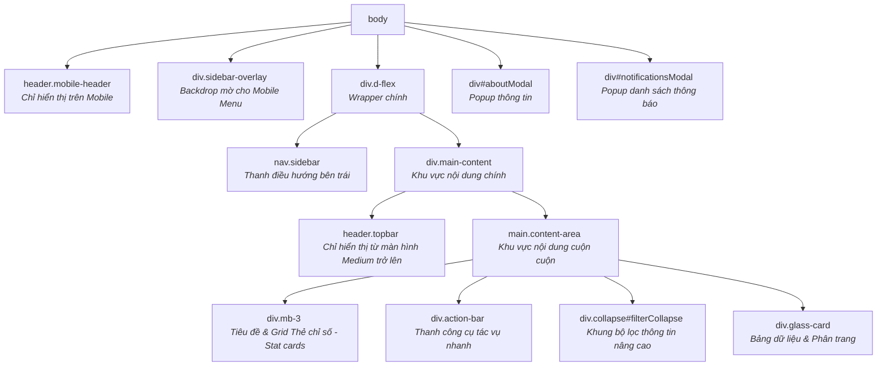

# ZenOS Layout Structure Summary

Tài liệu này tóm tắt cấu trúc layout (bố cục) của giao diện mẫu **ZenOS Enterprise Dashboard** (dựa trên tệp [index.html](file:///d:/Backup/Source%20code/ZenOSProject/ZenOSFrontend/ZenOSTemplate/index.html)). Layout này được thiết kế theo phong cách hiện đại (Glassmorphism, Dark/Light Mode), có tính phản hồi cao (Responsive) cho cả thiết bị di động (Mobile) và máy tính (Desktop).

---

## 1. Sơ đồ Cấu trúc Phân cấp (DOM Tree Hierarchy)

Cây thư mục HTML tổng quát của Layout được tổ chức như sau:

---

## 2. Chi tiết các Thành phần Layout Chính

### A. Mobile Header (`header.mobile-header`)
*   **Trạng thái hiển thị:** Ẩn trên Desktop và hiển thị trên Mobile (được điều khiển bằng CSS Media Queries).
*   **Chức năng tích hợp:**
    *   Nút đóng/mở Sidebar (`#mobileMenuToggleBtn`).
    *   Logo thương hiệu (`.mobile-brand`).
    *   Các Action Dropdown rút gọn bao gồm: Thông báo (Notification), Cài đặt nhanh (ellipsis menu chứa nút đổi Theme, ngôn ngữ, About) và Avatar người dùng.

### B. Sidebar (`nav.sidebar`)
*   **Trạng thái hiển thị:**
    *   Trên Desktop: Luôn hiển thị cố định ở phía bên trái màn hình (`width: 260px`).
    *   Trên Mobile: Ẩn đi và chỉ trượt ra ngoài (Off-canvas) khi người dùng nhấn vào nút Menu Toggle trên Mobile Header.
*   **Nội dung bên trong:**
    *   Thương hiệu chính (`.sidebar-brand`) kèm nút đóng Sidebar trên mobile (`#sidebarCloseBtn`).
    *   Danh mục điều hướng dạng Accordion (`#sidebarAccordion`) gồm nhiều phân hệ lớn:
        *   Dashboard, Sales, Products, Customers, HRM, Operations, Communication, Access Control, Categories.
    *   Chân trang Sidebar (`.sidebar-footer`) chứa menu Cài đặt hệ thống (System Settings, Tax, Payment, POS).

### C. Desktop Topbar (`header.topbar`)
*   **Trạng thái hiển thị:** Ẩn trên Mobile và tự động hiển thị từ màn hình Medium trở lên (`d-none d-md-flex` sử dụng utility classes của Bootstrap).
*   **Chức năng tích hợp:**
    *   Thanh tìm kiếm hệ thống (`.topbar-search-wrapper`).
    *   Các nút tiện ích phía bên phải:
        *   Chuông thông báo tích hợp Dropdown chứa danh sách update chưa đọc.
        *   Bộ chuyển đổi ngôn ngữ (Language Dropdown).
        *   Nút chuyển đổi chế độ sáng/tối (Dark/Light mode toggle).
        *   Nút mở Popup Giới thiệu (About Modal).
        *   Menu thông tin cá nhân kèm Avatar.

### D. Main Content Area (`div.main-content`)
Đây là vùng không gian hiển thị toàn bộ nội dung tính năng của trang web, bao gồm:
1.  **Topbar:** Nằm ở trên cùng khu vực nội dung (ở chế độ Desktop).
2.  **Scrollable Canvas (`main.content-area`):** Khung chứa nội dung có thể cuộn dọc, nơi hiển thị các view làm việc chính của ứng dụng:
    *   **Header Section:** Chứa tiêu đề trang hiện tại (ví dụ: *Operations Overview*) và một grid gồm 4 thẻ thống kê nhanh (Stat Cards).
    *   **Action Bar:** Thanh tác vụ linh hoạt, cung cấp các hành động chuẩn (Create, Update, Delete, Import, Export, Filter).
    *   **Filter Collapse Card:** Khung bộ lọc đa tiêu chí sử dụng hiệu ứng sụp mở (Collapse) của Bootstrap, tích hợp Custom Multi-Select Dropdown.
    *   **Table Card:** Một cấu trúc thẻ kính mờ chứa bảng dữ liệu responsive (`.table-responsive`) và thanh điều hướng phân trang (`.table-footer`).

---

## 3. Các Lớp CSS Đặc trưng (Design System Highlights)

Layout được áp dụng các phong cách thiết kế hiện đại qua các class tự định nghĩa trong `styles.css`:
*   `glass-card`: Áp dụng hiệu ứng kính mờ (Glassmorphism) với `backdrop-filter: blur()`, viền trong suốt nhẹ và đổ bóng mềm mại.
*   `ghost-input` / `ghost-button`: Các ô nhập liệu và nút bấm tối giản, trong suốt, chỉ nổi bật lên khi di chuột (Hover effect).
*   `status-badge`: Bộ nhãn trạng thái sinh động (`status-optimal`, `status-warning`, `status-critical`, `status-offline`) có kèm chấm nhấp nháy chỉ báo trạng thái thực tế.
*   `sidebar-nav`: Hệ thống liên kết kết hợp icon đẹp mắt từ Font Awesome, hỗ trợ hiệu ứng chuyển đổi mượt mà (`transition-smooth`).

---

## 4. Các Scripts Điều khiển Layout chính
Layout đi kèm một số đoạn script nội bộ (Inline Scripts) để xử lý các logic tương tác giao diện trực tiếp nhanh chóng:
*   **Theme Mode Switcher:** Lưu và đồng bộ trạng thái Dark/Light Mode qua `localStorage` (sử dụng thuộc tính `data-theme="light"` trên thẻ `<html>`).
*   **Mobile Off-canvas:** Quản lý đóng/mở Sidebar trên thiết bị di động thông qua việc bật/tắt class `active` trên `.sidebar` và `.sidebar-overlay`.
*   **Notification/Language Sync:** Đồng bộ hóa các dropdown trùng lặp giữa giao diện Mobile và Desktop khi người dùng thực hiện thay đổi.
